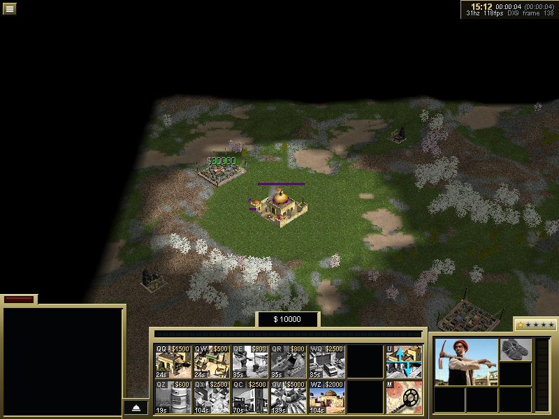
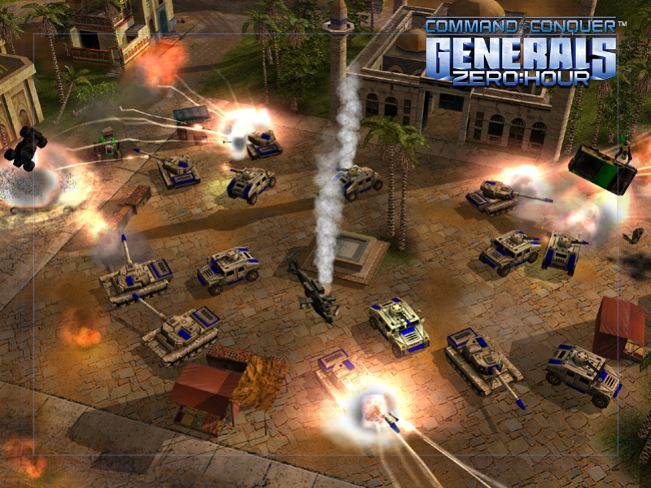

# A — the renderer on POSIX through a D3D9-shaped device (decision 7)

Owner: -a9. The route and its measurements are in [`RENDERER-ROUTE-RECON.md`](../RENDERER-ROUTE-RECON.md),
and the decision is in the README (decision 7). Phases: **A0** (the only Windows-visible one), **A1**
(a POSIX-only header of the D3D9 names, so WW3D2 and W3DDevice compile and link), **A2** (CPU-backed
resources), **A3** (the draw on SDL3 GPU).

## A0: Win32 types out of the renderer (2026-09-26)

**Scope.** WW3D2 and W3DDevice, as the POSIX build compiles them: lines inside `#if _WIN32` are left
alone, since they never reach the POSIX device. Found with `unifdef -b` (Windows macros unset,
`__APPLE__` set), which keeps line numbers.

Left out, and why:
- the D3D11 backend (`dx11*`), `d3dx9runtime`, `d3d8shadertranslate`: Windows-only by definition;
- `test_dx8_smoke`/`test_dx9_smoke`: Windows tests;
- `FramGrab` (the AVI writer) and `dx8webbrowser`: not built off Windows;
- `render2dsentence` (GDI fonts): D6's;
- `W3DMouse` (the hardware cursor): C3's;
- `d3dx9math.h`: its `FLOAT`s are all in its Windows branch.

`WORD`, `BYTE`, `BOOL`, `UINT`, `USHORT` and `LPCSTR` stay: `bittype.h` already gives them their
Windows widths off Windows (B10's decision, recorded there).

**The conventions.** B5's rule: a scalar in disguise becomes an engine type, and a type that crosses
a boundary gets a platform name.
- **A scalar that never reaches the device by address** becomes each library's own type:
  - `DWORD` becomes `uint32` in WW3D2 (its idiom: `bittype.h`, 121 uses already) and
    `UnsignedInt` in W3DDevice;
  - `LONG` becomes `Int`, `ULONG` becomes `uint32`, `FLOAT` becomes `float`, `CONST` becomes
    `const`.
- **A type that crosses the device interface** takes a name from `Libraries/Include/Platform/RenderTypes.h`,
  which on Windows **is** the SDK type (a typedef), and off Windows a fixed width:

  | Name | Windows | Off Windows | For |
  |:--|:--|:--|:--|
  | `RenderUInt32` | `DWORD` | `uint32_t` | a variable the device writes through a pointer (`GetRenderState`, `GetTextureStageState`, `ValidateDevice`), an array it reads (vertex declarations, shader bytecode) |
  | `RenderResult` | `HRESULT` | `int32_t` | a device call's result, and functions passing one on |
  | `RenderRect`, `RenderPoint` | `RECT`, `POINT` | `{int32_t ...}` | rectangles and points handed to the device |
  | `RenderWindow` | `HWND` | an opaque pointer | the device's window (`_Hwnd` in `dx8wrapper.cpp` and `ww3d.cpp`), which is C2's |
  | `Render_Failed`, `Render_Succeeded` | `FAILED`, `SUCCEEDED` | `< 0`, `>= 0` | the tests on a result; `HRESULT` is signed and `FAILED` tests `< 0`, and so do these |
  | `RENDER_FAIL` | `E_FAIL` | `0x80004005` | the renderer's own generic failure |

  `S_OK` becomes `D3D_OK`, D3D9's own name, which the SDK defines as `S_OK`.
- **Where the header comes in.** `RenderTypes.h` includes `<windows.h>` on Windows. So it comes
  into `dx8wrapper.h` straight after `<d3d9.h>`, and into any other file only after that file's own
  includes, and only where the file already used an SDK type there, so that `windows.h` is always
  in before it. That keeps `win.h`'s and winsock's ordering where it was. Each insertion point was
  checked.

**What changed.**
- 3 commits:
  - `fix(ww3d2)`: 20 in-class `Class::member` declarations that MSVC tolerates and clang refuses,
    found by re-sweeping until none were left, plus `PASS_MAX`. macOS's `<limits.h>` defines that as
    a macro; Westwood's own Solaris `#undef` is widened to cover it;
  - `feat(platform)`: `RenderTypes.h`;
  - `refactor(ww3d2,w3d)`: 37 files.
- **The first pass was scripted, and every result was read.** The script's mistakes, all corrected
  before commit:
  - `RenderUInt32` on reinterpreting casts (`F2DW`, the fog and depth-bias casts) and on local
    tables and arrays;
  - a file-wide name match that caught loop counters;
  - `Vertex_Format`'s definition and declaration getting different types;
  - `SceneClass::POINT` taken for the Win32 type;
  - four edits inside comments;
  - a header whose `<d3d9.h>` came after the insertion point.
- **Every `HRESULT`, `FAILED` and `SUCCEEDED` site was read.** Each tests a D3D or D3DX result, a
  `RenderResult` variable, or an engine function that returns one. The two `%lx`/`%ld` formats
  print casts or `unsigned long`s that did not change.

**Checked.**
- `windows_view_diff.py HEAD..WORKTREE` over the 37 files, normalised by the table above: every
  changed line is its old self under the substitutions, except the two intended changes (W3DWater.h's
  qualifications; `shader.cpp`'s `ULONG` mask, 32 bits either way).
- `RenderTypes.h` compiles with mingw-w64 against the real `windows.h` and with clang off Windows. Its
  sizes are `static_assert`ed: 4, 4, 16 and 8 bytes, and `RenderResult` signed.
- The macOS build and ctest (42 of 42) are unaffected.
- **Not compiled with MSVC.** WINDOWS-DEBT has the row.

**Left for A1** (Win32 calls, not types, in code the POSIX build compiles; they go behind
`#if _WIN32` with POSIX bodies where the device needs one):
- `dx8wrapper.cpp`: `LoadLibrary` of d3d9 (`HINSTANCE`), the monitor and gamma DCs (`HDC`,
  `GetDesktopWindow`, `GetDC`), `GetWindowLong`/`SetWindowPos`/`ShowWindow`/`GetClientRect` on the
  device window, and `Direct3D11_Create`;
- `ww3d.cpp`: `GetWindowRect`;
- `W3DDisplay.cpp`: the BMP screenshot writer (`CreateFile`/`WriteFile`, `HANDLE`, `LPBYTE`), the
  process launch (`dwTmp`, `exitCode` stay `DWORD`), and `ApplicationHWnd`, which is C2's;
- `W3DWaterTracks.cpp` (`ApplicationHWnd`), `W3DInGameUI.cpp` (`GetDC`),
  `texturethumbnail.cpp` (`FindFirstFile` for `*.mix`, which should go through C1's listing),
  `part_ldr.cpp` (`lstrlen`), `surfaceclass.cpp` (`ZeroMemory`);
- `W3DShaderManager.cpp`: `*(LARGE_INTEGER*)&m_driverVersion = did.DriverVersion`. A1's header
  decides the type of `D3DADAPTER_IDENTIFIER9::DriverVersion`.

## A1: WW3D2 and W3DDevice compile and link off Windows (2026-09-26)

**The checkpoint holds.** WW3D2 and W3DDevice compile on macOS with no errors, and `w3d_link_probe`
links all of both (whole archive, `-force_load` on macOS) against `posixdevice` and `gameengine`, so
every symbol they reference resolves; `nm` shows W3DDisplay and DX8Wrapper in it. Both libraries and the
probe are in the default build. From 152 failing translation units to 0.

**The D3D9 names.** `Libraries/Include/Platform/D3D9Posix.h`, POSIX only, written from Direct3D 9's
published values and `#error` on `_WIN32`; no `DWORD`, `HRESULT`, `HWND`, `IID` or `GUID`.
`D3D9PosixMath.h` holds `D3DVECTOR` and `D3DMATRIX` alone, for `d3dx9math.h`, so GameEngine still sees
no more of D3D9. `Platform/PosixD3D9/{d3d9,d3d9types,d3d9caps}.h` redirect to it, on the POSIX renderer
targets' include path only, so no `#include <d3d9.h>` changed.
`Tools/d3d9posix_check.py` compiles the header against MinGW-w64's `d3d9.h` and asserts 404 enumerators,
156 macros, 23 function-like macro samples, `D3DDECL_END()`'s fields, 22 structures (204 field offsets)
and both IIDs' bytes; a false control must fail, and it fails on any function-like macro without samples
or enumerator without a written value. `*_FORCE_DWORD` is not compared: Wine gives some `0xffffffff`,
Microsoft `0x7fffffff`; the header uses Microsoft's and asserts the four-byte width. -18 second-read the
header and `RenderTypes.h`; their one finding (`IID`) and both hardenings are in.

**The device** (`GameEngineDevice/Source/PosixDevice/Render/`, library `posixd3d9`, split by file with
-18, who owns A2): `PosixDevice9.h` declares the adapter and the device; `Direct3DCreate9` returns a real
adapter; `CreateDevice` accepts a null window, since `-headless` starts no video and its device has to
work as Windows' hidden-window one does. With no window a draw succeeds and does nothing; with one it
fails loudly until A3. State is kept as set; D3D9's documented defaults for the render states are A3's.

**D3DX off Windows** (`WW3D2/d3dx9posix.cpp`): the matrix functions compute (renderer only: the
simulation's `D3DXVec4Transform`/`D3DXVec4Dot` stay `d3dxportable.h`'s); `Get_FVF_Vertex_Size` computes
from the FVF bits; the pointers stay pointers, since call sites test them, and all are bound. Shader
assembly fails for good (A3 draws generated HLSL). The texture helpers are -18's
(`d3dx9posix_texture.cpp`). `d3dx9posix_selfcheck` checks the FVF size against 12 of `dx8fvf.h`'s vertex
structures, and the matrices against a double-precision reference and known images; four mutation
controls fail it. It does not compare rounding with `d3dx9_43.dll`: `Tests/d3dx_oracle` could, and that
is left for A3, where the matrices reach the picture.

**Direct3D 11 off Windows:** `dx11runtime_posix.cpp` answers all 76 calls, and the buffer twin's lock, as
a machine where Direct3D 11 failed to start.

**The compile fixes**, by kind (the commits list each):
- MSVC tolerances clang refuses, spelled the ISO way with MSVC's meaning: functional casts, `false` as a
  null pointer, default arguments at the definition, `register`, friend-only names, a dependent base's
  members, in-class `Class::member`, extern-then-static, `StringClass(NULL)`, `StringClass` through
  varargs, rvalues to non-const references, the address of a temporary, forward-declared enums;
- `Xfer.h` first in six draw modules: it reaches `BitFlagsIO.h`, whose templates use `Xfer` before it
  is declared, and clang parses template bodies where they stand. `Drawable.h` goes first now;
- Win32 API with an exact C equivalent at the call site (`lstrcpy`, `lstrcpyn`, `ZeroMemory`, ...);
- Win32 behaviour with no POSIX meaning in the renderer behind `_WIN32`, each with its POSIX answer
  beside it: the registry, the embedded browser, window style and size, desktop gamma and display mode,
  movie capture, the front-buffer screenshot, the `.ANI` cursor images, the wave editor, the ffmpeg
  launch;
- 335 includes respelled to the on-disk case (`include_case_check` reads W3DDevice now).

**Handed on:**
- **C2 (-18):** define `RenderWindow ApplicationHWnd` (null under `-headless`) and
  `Bool ApplicationIsBorderless` off Windows; W3DDisplay's window style and size calls are no-ops off
  Windows, so the window follows a display-mode change on C2's side. `W3DGameClient` off Windows leaves
  `createKeyboard`, `createMouse` and `createVideoPlayer` to the platform's subclass. The stand-ins in
  `PosixRenderHooks.cpp` go when `generals` links `w3ddevice` (-18 agreed to take that).
- **C3:** `W3DMouse` is out of the POSIX build; the cursor and the order-cursor images are yours.
- **D6:** `render2dsentence`'s GDI font is behind `_WIN32`; off Windows every glyph is blank and zero
  wide until the rasteriser lands.
- **A2 (-18):** resources, surfaces, `Clear`, the caps (VS/PS 0.0 until A3 implements a shader path,
  so `getChipset` answers `DC_UNKNOWN` and every renderer path is fixed-function).
- **A3:** draws, `Present`, gamma, render-state defaults, screenshots off Windows, stage-0 colour
  `D3DTOP_DISABLE`, the D3DX oracle comparison.

**Findings on the way, not changed:**
- W3DDisplay's Windows `CreateBMPFile` read `(w+7)/8*h*24` bytes from a `3*w*h` image: an over-read
  whenever the width is not a multiple of 8, and a skewed picture when it is not a multiple of 4.
  Defect #18, fixed after A1 by making the POSIX writer the one writer.
- `d3dx9math.h`'s Windows `D3DXMatrixInverseFunction` returns `HRESULT` where D3DX returns a
  `D3DXMATRIX *`; nobody reads the result, so nothing breaks today.
- `dx8fvf.h`'s `VertexFormatXYZNUV2DMAP` is 48 bytes against its FVF's 52; nothing sizes a buffer by
  either.
- CMake's comment calls `dx8webbrowser.cpp` inert; its header sets `ENABLE_EMBEDDED_BROWSER` to 1.
- Two pointer truncations, fixed because clang refuses them, neither reachable by a player:
  `surfaceclass.cpp`'s would fault above 4 GB but only `Font3D`, which the game never creates, calls it;
  `assetmgr.cpp`'s subtracts two truncated pointers, which is right modulo 2^32. Both are in the
  README's latent list. (An earlier report of mine called both shipping defects; that was wrong.)

**Windows:** every changed `.cpp` compiles under MinGW-w64 against the Windows headers with no error it
did not have before; the Windows `ww3d2` source set is unchanged. Not compiled with MSVC: WINDOWS-DEBT
has the row.

## A2: the device's resources, and every install texture through them (2026-09-26)

**The checkpoint holds.** `test_install_textures` (ctest, needs the install) brings WW3D up as
W3DDisplay::init does with no window, which is `-headless` off Windows: `WW3D::Init(NULL)`, then
`Set_Render_Device`. Both return OK on the POSIX device, with an 800x600 implicit back buffer and the
missing-texture stand-in. Then every `.tga` and `.dds` path in the install's archives, all 7,342 of
them, goes through WW3D2's own loader (`TextureClass`, `TextureLoader`, `DDSFileClass`, `Targa`,
`BitmapHandlerClass`) into the device. Each is read back and checked against the file on the CPU.
- **Loaded:** 7,342, none of them the missing texture: 6,602 `.dds` and 740 `.tga`.
- **How they were asked for:** 6,810 by bare name through `W3DFileSystem`, as the game asks. 532 by
  path: Art\Terrain, the map previews, and the 27 Art\Textures files the localised folder shadows
  (the game only ever reaches the localised copy).
- **Compared:** 48,975 levels, 0 different.
  - **A `.dds`:** the device keeps its format and size. Its level count is the file's, less any level
    narrower than 4, as the loader decides. Every level's blocks equal the file's, byte for byte.
  - **A `.tga`:** decoded by the test, not by `Targa`, top row first. It is point-sampled to the
    power-of-two size as `BitmapHandlerClass` samples (36 are rescaled). Every mip level WW3D2's
    generator defines is checked against the same 2x2 combine, computed by the test.
  - **Level 0, read a second way** through `GetSurfaceLevel`: agrees for every texture.
- **Hash:** the compared bytes hash to `9ee41084bc04dc1b`, the same on two runs. A Windows run of the
  test should print the same value; that has not been done.
- **Armed controls:** each fails the check as it should.
  - One byte of a loaded level changed on the device, for a `.dds` and for a `.tga`.
  - The expectation turned upside down.
  - A name nothing holds (it loads as the missing texture).
- **Rule 9:** the test mounts a read-only farm of links in `$TMPDIR` and removes it. A listing of the
  install before and after is identical.

**Found by the checkpoint, fixed (defect-class, Windows-visible):** `WWLib/TARGA.H`'s TGA 2.0 footer and
extension structs held `long` fields. `long` is 32 bits on Windows and 64 on macOS and Linux, so the
footer read 34 bytes where the file has 26, and `Targa::Open` failed on every TGA. All 740 then loaded
as the missing texture. The fields are `int` now, which is what `long` was on Windows, and
`static_assert`s pin the file sizes, 26 and 495. WINDOWS-DEBT has the row.

**What the checkpoint cannot see:**
- drawing (A3);
- textures the game builds rather than loads (the terrain atlas, render targets);
- cube and volume files (the install has none);
- texture reduction and HSV shifts (both off on this path);
- an X8R8G8B8 texel's X byte;
- the 24 tail mip levels whose narrower side has reached 1. WW3D2's generator writes one texel or none
  there, on Windows too, so they hold the device's initial memory.

**What A2 built** (the commits have the detail):
- **`PosixResources9`:** textures, cube and volume textures, surfaces and buffers, in D3D9's block
  layouts, DXT kept compressed, with D3D9's lock rules.
- **`PosixPixelCodec`:** the packed formats and DXT1-5.
- **`PosixImageOps`:** copies, conversions and D3DX's filters.
- **`PosixDevice9Resources`:** the Create* methods, the copies, `Clear` and the implicit surfaces.
- **`PosixD3D9Caps`:** the profile agreed with -a9: no vendor, VS/PS 0.0, and TextureOpCaps equal to
  the generator's ops.
- **`d3dx9posix_texture.cpp`:** D3DX's texture helpers.
- **`test_posix_resources`:** 26 tests, 790 checks.

**The render-target seam with A3** (agreed, above in A3's design): when a window exists, A3 owns a render
target's pixels. The per-surface `gpuOwned()` query, the `Sync_Gpu_Surface` call in the three read paths
and a GPU write that does not bump `version()` are A2-side hooks. They are not in this merge, since A3a
does not need them; -18 adds them before A3 draws into a render target.

## A3 design: the draw on SDL3 GPU (approved 2026-09-26)

Not code yet. What A3 builds, in what order, and how a draw is proven right. It is `dx11backend`'s
design (resolve D3D9 state at the draw into cached programs, pipelines and state objects) on SDL3 GPU,
with D3's generators and D3's slot contract (`WW3D2/sdl3target.h`), inside the POSIX device.

### Where it runs, and where it does not

- **Only with a window.** Under `-headless` the device has no window and makes no `SDL_GPUDevice`
  at all; draws succeed and do nothing, and A2's CPU resources are the whole story (decision 8's
  refinement). With a window, `CreateDevice` makes the `SDL_GPUDevice` (SPIR-V or MSL, as the spike
  does) and claims C2's window (`RenderWindow` cast back to `SDL_Window *`, in one place).
- **One thread.** Every SDL GPU call is on the main thread. The texture loader thread creates and
  fills CPU resources only (A2); their upload happens at the draw that first uses them.
- **Files** (`PosixDevice/Render/`, library `posixd3d9`, mine): `SdlGpuDevice` (device, swap chain,
  frame, present), `SdlDrawResolve` (D3D9 state to generator descriptions and keys; the counterpart of
  `dx11backend`'s `Build_*_Description`), `SdlProgramCache`, `SdlPipelineCache`, `SdlSamplerCache`,
  `SdlResourceMirror` (GPU copies of A2's images and buffers), `SdlConstants` (the constant blocks).
  Each is a class with a unit test, as `dx11*` is.

### The frame: a recorded draw list, flushed in two passes

SDL3 GPU uploads in a copy pass and draws in a render pass, and a copy pass cannot open inside a
render pass. D3D9 lets the engine write a buffer between two draws of one scene (dynamic buffers
with `DISCARD`/`NOOVERWRITE`, `DrawPrimitiveUP`). So a draw is **recorded**, not issued:

- At `Draw*`: resolve the pipeline, sampler set and constant blocks (below), and **snapshot what the
  draw reads that can still change this frame**: the vertex range `[min_vertex, min_vertex +
  vertex_count)` of each dynamic or transient stream, the index range, `DrawPrimitiveUP`'s data, and
  the constant blocks. The snapshot is a copy into a per-frame staging ring (CPU memory); the record
  holds offsets into it. A static (managed) texture or buffer is referenced by its A2 object and its
  `version()` at record time.
- At a flush point (`EndScene`... strictly: `Present`, a render-target or depth-surface change,
  `GetRenderTargetData`/a lock of a render target, or the ring filling), one **copy pass** uploads the
  ring into a transient GPU buffer and every static resource whose GPU copy is older than the version
  a record needs, then one **render pass** per render target replays the records in order.
- **A static resource written again after a draw used it, in the same frame** (a managed texture
  updated mid-scene): the record's version no longer matches, so that draw's copy of it goes through
  the ring too. Each draw sees what D3D9 would have shown it. Counted, since it should be rare.

Uniforms are pushed with `SDL_PushGPU*UniformData` only when the block's bytes differ from the last
push in that command buffer (SDL3: "subsequent draw calls in this command buffer will use this
uniform data"). Clears become the render pass's `CLEAR` load op when a whole target is cleared first,
and a clear draw otherwise.

### Programs: generated, compiled once, cached on disk

- **Descriptions and keys** exactly as `dx11backend` builds them: `CombinerDescription` walked until
  `COLOROP == DISABLE`, `VertexPipelineDescription` with the enabled lights packed, the same memset
  discipline so descriptions compare with `memcmp`, and D3's own keys (`VertexShader_Key`,
  `CombinerShader_Key`). Target `SDL3_GPU`.
- **Stage-0 colour `DISABLE`** (the generator refuses it, since dx11backend ends the chain there):
  D3D9 defines it as "no texturing, the diffuse colour"; resolved as a one-stage `SELECTARG1(DIFFUSE)`
  combiner with the alpha op kept. Checked by the reference below.
- **Program cache:** key string to `SDL_GPUShader` plus its binding table: the sampler and uniform
  counts from `SDL3_Shader_Slots`, and the `// SDL3 slot N: texture tT, sampler state sS` lines,
  parsed once, which say which texture and which sampler state go to slot N. A refused description
  goes in a negative cache and the draw is refused and counted by reason, as dx11backend does: never
  approximated.
- **Compile ahead of need** (decision 4: Metal takes 50-225 ms a program at first use). SPIR-V (and
  MSL on Metal) is cached on disk under the user data directory, keyed by a hash of the HLSL and the
  compiler versions; a warm-up list of the keys seen in earlier runs is compiled at start, before the
  shell map. A miss at the draw compiles synchronously, is counted, and logged once per key.
- **Engine shaders** (`.vso`/`.pso` and the water programs) wait: with caps at VS/PS 0.0 the engine
  never loads them, and every path is fixed-function. A3's last step raises the caps and registers
  them: off Windows `Direct3D11_Register_Engine_Shader` forwards to the device, and the water
  programs, whose D3D9 assembly never happens, are recognised by their source through a
  `D3DXAssembleShader` that returns a token naming the source instead of bytecode. Designed then, not
  now.

### Pipelines and samplers

- **Pipeline key**, a packed POD compared and hashed by its bytes: vertex program and pixel program
  (indices into the program cache), the vertex layout (FVF and stride; `D3DCOLOR` as `UBYTE4_NORM`
  per D3's contract, the program swaps `.bgra`), the primitive type, and the state SDL3 bakes in:
  blend enable, source, destination and operation for colour and for alpha (D3D9's
  `SEPARATEALPHABLENDENABLE` or the colour ones), colour write mask, depth enable, write and compare,
  stencil enable, compare, the three operations, read and write masks (both faces for two-sided
  stencil), cull mode (D3D9's `CULL_CCW` culls counter-clockwise, so front face is clockwise and cull
  is back), fill mode, depth bias and slope scale, and the target's colour format, depth format and
  sample count. Stencil reference, viewport and scissor are dynamic and not in it. A last-key fast
  path, then a hash map, as dx11state's objects are.
- **Primitive types:** list, strip, line list, line strip, point list map directly. **Fans do not
  exist in SDL3 GPU**: a fan is expanded into a triangle list's indices in the ring at record time.
- **Samplers:** key = min, mag and mip filter, U/V/W address modes, max anisotropy, mip LOD bias,
  max mip level, border colour; one `SDL_GPUSampler` per key, created once. Slot n is texture n with
  sampler n unless the program's slot lines say otherwise; an unbound slot gets the 1x1 white texture.
- **Viewport:** D3D9's pixel centres, with the same half-pixel shift dx11backend makes.
- **Depth:** D32S8 where D24S8 is missing (Apple; D2's probe), and the depth bias scaled for the
  format.

### Resources on the GPU

- **Mirror** per A2 object: GPU texture or buffer, and the version last uploaded. Uploaded whole in
  the flush's copy pass when older than a record needs (ranges later, if the counts say so).
- **Texture formats:** BC1, BC2 and BC3 go up as they are (D5: sampled directly on the M3 Pro;
  M1/M2 untested), `A8R8G8B8` as `B8G8R8A8_UNORM`. Everything else is expanded to `B8G8R8A8` on
  upload with A2's codec, because SDL3 GPU has no component swizzle: `X8R8G8B8` has to read alpha 1,
  `L8`/`A8L8` replicate luminance, and the 16-bit formats are not everywhere. Correct first, compact
  later if the memory says so. -18's measurement: the install is DXT1/3/5 plus 24- and 32-bit TGA, so
  the expansion path is small.
- **Render targets** (shadow maps, water reflection, the back buffer): with a window, their contents
  live on the GPU. A2's CPU image is then stale, and a lock or `GetRenderTargetData` downloads it
  (`SDL_DownloadFromGPUTexture` and a fence) after a flush. `Clear` with a window clears the GPU
  target; -18's CPU fill stays the headless path. **Agreed with A2 (approved 2026-09-26):** with a
  window a render target's pixels are the GPU's, and A2's `Clear`, lock and read-back paths check the
  mode (a lock or `GetRenderTargetData` flushes and downloads first, and a download does not bump
  `version()`); headless, A2's CPU fill and copies are the whole story.
- **Present:** the back buffer is an offscreen target (as the spike's); `Present` flushes, acquires the
  swap-chain texture and blits it, with `SetGammaRamp`'s curve applied in that pass. Present mode from
  the present parameters' interval: vsync or immediate, the two D2 found everywhere.

### Correctness: every draw against the fixed-function formulas on the CPU

Decision 7 has no Windows frame to compare against, so the reference is D3D9's documented
fixed-function pipeline, computed on the CPU:

- **`FFReference`**, a CPU implementation written from Direct3D 9's documentation of the fixed-function
  pipeline, **not** from `ffshader`/`ffvertex`, the way `D3D9Posix.h` was written from the published
  values and checked against someone else's (the checker's principle: two independent readings). In
  double precision: transform to clip space, the D3D9 lighting equations (directional, point, spot;
  material sources; specular), fog (vertex linear, exp, exp2; the D3D9 factor), texture coordinate
  generation and transforms, then per pixel the perspective-correct interpolation, the texture read
  (point, bilinear and mip selection, from A2's CPU images), the stage combiner (every op the
  generator implements), alpha test, fog, and the blend with the destination.
- **Unit layer (ctest, no game data):** synthetic draws built in code, each isolating one thing: every
  combiner op and argument modifier, each light type, each fog mode, each TCI mode, each blend and
  compare function, fans, `DrawPrimitiveUP`, the stage-0 `DISABLE`. Each is drawn through the real A3
  path into an offscreen target cleared to a known pattern (and a depth buffer to known values), read
  back, and compared pixel by pixel with `FFReference` away from triangle edges. Tolerances are
  per quantity and stated: ±2/255 for arithmetic, wider for filtered reads, and the distribution is
  printed, not just a pass. An armed control (a deliberately wrong combiner op in the reference) must
  fail. Needs a GPU but no window: SDL3 GPU renders offscreen without one.
- **Capture layer (with game data, skipping visibly without):** `-drawcapture N` makes the device
  write the next N draws' complete state (every render, stage and sampler state, transforms, lights,
  material, viewport, program keys, constants) and the vertex, index and texel data they read, to the
  user data directory. The ctest runs the engine on the symlink farm (rule 9) to the shell map,
  captures, then replays each captured draw alone through A3 and through `FFReference`, as the unit
  layer does. Captures are made at test time from the user's install and never committed.
- **Coverage:** every pipeline key seen in a capture run is reported with whether a draw of it was
  checked, and every refusal by reason. A3 is done when the shell map and a skirmish's first minute
  draw with **no refusals** and **every key they use checked**, not when it looks right.

### Order

1. **A3a** the frame with a window: device, claimed window, offscreen back buffer, `Clear`,
   `Present` and the gamma pass. Checked: a cleared frame's read-back.
2. **A3b** `FFReference` and the unit layer's harness (offscreen, read-back, compare), before any
   draw goes through A3, so the first draw is checked when it lands.
3. **A3c** fixed-function draws: resolve, programs, pipelines, samplers, mirrors, the recorded list
   and the flush. The unit layer goes green one feature at a time.
4. **A3d** render targets, read-back, screenshots (the one writer now exists), `-drawcapture` and the
   capture layer; then the shell map.
5. **A3e** engine shaders: caps up, registration, the water programs; the pipeline pairs D3 found
   (Trees with ffshader programs, engine `.pso` programs with ffvertex ones).

**Depends on:** A2 merged (its image and buffer versions are the mirrors' invalidation); C2's window
(`RenderWindow`); C3 not at all. **Leaves to others:** the display-mode change of the window (C2).

## A3a: the frame (2026-09-26)

`PosixDevice/Render/SdlGpuFrame.{h,cpp}`: the `SDL_GPUDevice`, C2's window claimed (the one
`RenderWindow` to `SDL_Window *` cast), the offscreen back buffer (`B8G8R8A8`) and depth-stencil (D24S8,
else D32S8). A whole-target clear is recorded and becomes the next pass's load operations. `Present`
blits to the swap chain, or, when the ramp is not D3D9's identity (`i * 257`), runs a pass that looks
each channel up in its ramp (a 256 x 1 `R16G16B16A16` texture, point-sampled at entry centres, uploaded
when it changes). The device makes the frame only with a window (`Create_Gpu_Frame`, called by
`CreateDevice`; a window with no GPU device fails the device, loudly), and sends `Present` and `Reset`
through it. `Gpu_Clear` is the seam's hook for A2's `Clear`: the whole back buffer now, anything else
refused, loudly, until A3c's clear draw.

**Checked** (`sdl_gpu_frame_selfcheck`, Metal on the M3 Pro; exits 77, reported skipped, with no GPU):
a colour clear read back as D3D9's ARGB in every pixel; a depth-only clear keeps the colour; the gamma
pass exact (±1 level) on a picture where every pixel and channel differs, with an armed control that
differs in all 3,072 pixels; the identity ramp's blit returns the picture byte for byte. A mutation
that flips the pass's vertical texture coordinate fails every pixel. **Not checked:** presenting to a
real window (ctest has no display), and a device made through `CreateDevice` with a window, which needs
A2's implicit surfaces (merged separately) and a display. POSIX-only files: nothing a Windows build
compiles changes.

## A3c: fixed-function draws on SDL3 GPU (in progress, 2026-09-26)

What is in, each piece with a unit test:

- **The resolve.** `PosixDevice9Draw.cpp` reads the state as set into D3's generator descriptions and
  the two constant blocks, the way dx11backend does. It also holds D3D9's documented initial states.
  (`posix_draw_resolve_selfcheck`)
- **Programs.** `SdlProgramCache` covers HLSL through SPIR-V to `SDL_GPUShader`, the slot lines and a
  negative cache. On Metal, 27 programs compile in about 520 ms. (`sdl_program_cache_selfcheck`)
- **Pipelines and samplers.** `SdlPipelineCache` holds the vertex layout at D3's locations. The POD key
  covers blend, depth, stencil, rasterizer, the program pair, the FVF, the primitive and the formats.
  The sampler description is built from the sampler-state row. Point fill, border/mirror-once
  addressing and blend-weighted positions are refused. Every engine FVF's stride matches D3DX's own
  vertex size. (`sdl_pipeline_state_selfcheck`)
- **The batch.** `SdlGpuFrame` plus `SdlGpuFrameBatch.cpp`:
  - Clears and draws are recorded in order. Bytes that can still change are staged.
  - The flush is one copy pass, then render passes. A clear is the load operation of the pass after
    it, and a clear after draws ends the pass.
  - Uniform blocks are pushed only on change, per stage.
  - Every pass has the back buffer and the depth-stencil. With no depth surface bound, a draw gets
    depth and stencil off in its key instead of a different attachment.
- **GPU copies.** `SdlResourceMirror`:
  - Formats: DXT1/2-3/4-5 go up as BC1/2/3 where the GPU samples them and the base level is whole
    blocks. A8R8G8B8 goes up as B8G8R8A8. X8R8G8B8 is copied with alpha forced to 1. Everything else
    is decoded with A2's codec.
  - Copies are keyed by the A2 object's address and dropped by `posixResourceDestroyed` (-18's hook,
    agreed and reviewed).
- **The draws.** `DrawPrimitive`, `DrawIndexedPrimitive` and `DrawPrimitiveUP`:
  - Static buffers bind their copy. Dynamic buffers and UP data are staged from the first vertex the
    draw can read. Fans are expanded into staged list indices.
  - The viewport moves half a pixel as dx11backend's does. The scissor is the viewport.
  - An unbound slot samples 1x1 white.
  - `DrawPrimitiveUP` leaves stream 0 unbound, as D3D9 documents.
  - Refusals are counted by reason, logged once, and answer `D3D_OK`: programmable draws (A3e),
    other render targets or depth surfaces (A3d), user clip planes, cube and volume textures.

**One refinement of the design's "The frame".** The design says a static resource written again after a
draw used it goes "through the ring" for the later draw. But the earlier draw would still read the
later bytes, since the copy pass runs before every draw of the batch. What happens instead:

- A copy's new bytes are taken when the draw that needs them is recorded.
- A copy that this batch has already used, and that has changed, flushes the batch first.

Each draw sees what D3D9 showed it. The flushes are counted (`Stale_Flushes`): the engine's
per-frame writes go to `DYNAMIC` buffers, which are staged instead.

**Checked** (`posix_gpu_draw_selfcheck`, Metal on the M3 Pro, `ZH_GPU_DEBUG=1` validation clean; 77
without a GPU). Everything goes through D3D9 calls on a device with an offscreen frame, read back from
the back buffer:

- Placement: a pre-transformed quad with edges at x.25 covers D3D9's columns 9-24. Its clockwise
  triangles are front-facing under `CULL_CCW`, and are culled when wound the other way.
- A transformed, unlit quad.
- Textures: an A8R8G8B8 2x2 lands texel by texel in its quadrants. DXT1 goes up as BC1. X8R8G8B8
  blends as opaque. An unbound slot reads white.
- Buffers: a UP fan and an indexed fan with a base vertex. A static buffer rewritten between two draws
  shows both quads, with one stale flush. A dynamic buffer rewritten with `DISCARD` shows both, with
  none.
- Clears and depth: a clear between draws, and the depth test ordering two quads either way.
- Lifetimes and refusals: texture copies go with their textures. A cube texture is refused, counted,
  and draws nothing. A headless device records nothing.

Six mutations were each caught: no half-pixel shift, cull swapped, no stale flush, fan off by one,
X8 alpha left as stored, and a clear after draws ignored.

**Partial clears** (later, same branch): `Gpu_Clear` cuts each rectangle to the viewport, as D3D9 does.
One that covers the target is the load operation. Anything smaller is a clear draw: one triangle at the
clear's depth, scissored to the rectangle, whose pipeline is keyed by what it clears. Depth and stencil
always pass and are replaced, and what isn't cleared is masked. Checked with a viewport-cut clear, a list
of rectangles, and a depth-only rectangle that a following depth-tested draw sees in its own colour.
Two more mutations were each caught (no scissor; depth not written).

**Not yet:**

- a run of the game with a window: shell map and skirmish, refusal counts;
- the FFReference comparison (A3b's harness, next);
- the on-disk program cache and warm-up list.

## A3b: the harness against FFReference (2026-09-26)

`Tests/test_ffref_gpu.cpp` (`ffref_gpu_selfcheck`; 77 without a GPU) draws each scenario twice:

- on the device's GPU draw, through D3D9 calls;
- through -47's FFReference (`Tests/ffreference/ffreference.h`, whose header is the only part of it
  read here).

One helper sets every state on both sides, and `FFRef::compare` sorts each pixel into exact, inside a
documented freedom, or outside. There are 61 scenarios:

- rasterisation, perspective-correct colours and depth;
- point and bilinear filtering, and the three address modes;
- mips with each filter, and texture transforms;
- all 22 colour operations, and two stages;
- specular add;
- every light type, with and without specular and the local viewer;
- vertex fog in all three modes, and table fog's refusal;
- the alpha test, five blends, and the colour write mask;
- two armed controls (D3D10 pixel centres; texel centres at corners), which must come out outside.

Four GPU-side mutations were each caught: no half-pixel shift, XYZRHW read as three floats, MIPFILTER
NONE pinned, and an unbound texture read as white.

**Fixed on A3c from the first run** (`fix(posixdevice): read D3D9's rules the reference found
missing`; 50 of 56 scenarios were failing before, 0 after):

- XYZRHW read as four floats;
- MIPFILTER NONE keeps minification;
- an unbound COLORARG1 texture ends the cascade (N20);
- pretransformed vertices are never lit;
- a material source the vertex cannot supply reads the material;
- table fog is refused by name.

**Findings waiting on a decision.** The harness reports each one as KNOWN, and fails if one starts
passing, so the list cannot go stale. F1-F4 and F6 are in D3's shared generator (`ffvertex`,
`ffshader`), which Windows' D3D11 backend runs too, so a fix changes Windows' frames as well:

| # | What differs from D3D9 | Engine exposure |
|---|---|---|
| F1 | No per-light ambient. ffvertex.cpp:512 says W3D's lights leave it black, but light environments give point lights `getPointAmbient` (dx8wrapper.cpp:3776), and `Set_Light` copies `LightClass`'s ambient (3699). | Point lights: explosions, fires. |
| F2 | `LOCALVIEWER` is ignored: the halfway vector is always the infinite viewer's. D3D9's default is TRUE, and the engine never turns it off (W3DWater sets TRUE). | Every specular highlight. |
| F3 | `DOTPRODUCT3` as a colour op does not replicate into alpha. | render2d.cpp:687 and W3DShaderManager.cpp:791, stage 1. |
| F4 | 2D texture coordinates under `TTFF_COUNT2` are padded (u, v, 0, 1), so the translation is read from `_41`/`_42`. D3D9 pads (u, v, 1, 0), and the engine's scrolling mappers write `_31`/`_32` (mapper.cpp:183). | Scrolling textures do not scroll. |
| F6 | No vertex specular: the post-cascade specular add has nothing to add unlit. | No engine FVF found with a specular colour. |
| F7 | An absent vertex specular: FFReference reads 0xFFFFFFFF (N7, from the D3DTA page), the GPU adds nothing. -47 and I disagreed; the page decides it, so this is a finding. | SPECULARENABLE on an FVF without specular: not seen in the engine. |
| F8 | Flat shading is not generated (Gouraud always). | Only the volumetric shadows (W3DVolumetricShadow.cpp:3805), which write stencil. |
| F11 | Apple's LOD: +0.10 to +0.20 on average against the exact derivative, up to +0.58 on an anisotropic footprint (the harness's LOD probe). That fits an L1-like ρ (up to +0.5) plus 2x2 differencing. **-47's ruling:** a symmetric ±0.6, since D3D9 never defines the footprint norm and anything from L∞ to L1 is within √2 of L2, plus 0.1 for differencing. The harness sets it now. Still KNOWN until FFReference also evaluates the integer λ crossings inside the widened interval: with the endpoints alone, linear mips went from 213 outside to 424 (worst 19/255), and point mips kept 4 (worst 126/255, a level jump). | Mip transitions shift by up to half a level, which is inside the ruled freedom. |

Not findings: table fog (refused by name; the engine never sets it), and N6 (lit specular only with
SPECULARENABLE, which the GPU matches).

### The first windowed skirmish on Metal (2026-09-26)

`generals -root <farm> -randommap 1234 2 small -autoskirmish 2 -seed 1234 -maxframes 600` without
`-headless`, on a rule-9 symlink farm with `Code/Data` overlaid.

Result: exit 0 at the frame limit. 2,893 presents and 1,991,434 draws were recorded on Metal (M3 Pro).
There was one refusal reason: "a render target other than the back buffer (A3d)", 24,157 draws. No
program, pipeline, texture, sampler or format was refused. The picture is present 599, taken before
the gamma ramp by the `ZH_GPU_DUMP_FRAMES` aid.

It took one fix outside the renderer first: particle orientation was an undefined float→byte cast,
which ARM64 turned into a read 190 GB past the table. See the latent-UB list in the README.

**The picture was replaced after defect #27.** The first dump had the trees as black silhouettes.
`ZH_GPU_TRACE` showed their shroud stage (stage 1, camera-space texgen, set 0) sampling with stage 0's
coordinates. That was a generator mismatch, which Windows' D3D11 renderer has too. D3D9's combiner shaders do not,
by bfb60e17's measurement (README #27). The picture above is the same run after the fix, where the pale patches are the blossom trees,
textured and shrouded. The run: exit 0, 2,440 presents, 1,633,250 draws, and the same single refusal
reason (20,281 render-target draws).

**#27 was the terrain's fault too.** The trace of the terrain draws shows the blend-tile pass using
stage 0 with `TEXCOORDINDEX` 1 (the blend tile's own set) and alpha blending on. Before #27 its pixel
program sampled `TexCoord[1]`, which is stage 1's slot. Stage 1 is disabled there, so that slot held
(0, 0), and every blend tile was one texel of the atlas: the blotchy, blocky patches. In the picture
above the tiles blend with soft edges. It has not been compared with a Windows frame; that needs E4's
CrossOver run.

**Known wrong in this picture:** the radar is empty. It is a render target, which is A3d.

## A3d: render targets, read-back, the front buffer (2026-09-26)

- **Render targets.** The frame draws into any render target: the back buffer, the first level of a
  `D3DUSAGE_RENDERTARGET` texture, or a standalone render-target surface. There is one pass per target,
  and a waiting clear stays with its own target.
  - A render-target texture's GPU copy is a colour target that its later draws sample. It is uploaded
    only when the CPU writes its image.
  - A target smaller than the back buffer gets a size-matched scratch depth-stencil.
  - Drawing into a target while sampling it is refused.
- **The seam with -18**, agreed and built on both sides:
  - `Gpu_Owns`;
  - `Gpu_Download`, through their `posixWriteFromBgra`, which leaves `version()` alone;
  - `Gpu_Download_Front`, from a copy of each presented frame;
  - `Gpu_StretchRect`, a GPU blit.
  -18's surface code calls them from Clear, `GetRenderTargetData`, `GetFrontBufferData`, `StretchRect`,
  and the partial CPU writes that must download first.
- **Checked** by `posix_gpu_draw_selfcheck`, through D3D9 calls, with Metal validation clean:
  - a target drawn, then sampled onto the back buffer;
  - `GetRenderTargetData`;
  - `StretchRect` as a GPU blit;
  - `GetFrontBufferData` after Present and a later clear;
  - four mutations caught.

**The game on it.** The windowed skirmish (seed 1234, 600 frames) and the shell map (`-quickstart`, 60 s)
both run with **no refusals at all**:
- the skirmish: 2,483 presents and 1,665,243 draws;
- the shell map: 3,635 presents and 1,398,108 draws.
Without `-quickstart` the intro movie plays through V1's Bink path.

**Known gap, deferred with -18:** a partial *writing* `LockRect` of a GPU-owned render target keeps the
CPU image, and the upload its version bump causes overwrites the GPU's pixels outside the locked rectangle.
The engine does not lock render targets anywhere known (screenshots and smudges read through
`GetRenderTargetData` into SYSTEMMEM). If a path turns up, the fix is a hook at the surface or texture
`LockRect` (which knows its owner) that downloads first.

The skirmish's empty radar is not the renderer's. Its draw callback, `W3DLeftHUDDraw`, is never called
(lldb), so the question is the fork's HTML control bar and GUI. The PM has given it to -47.
