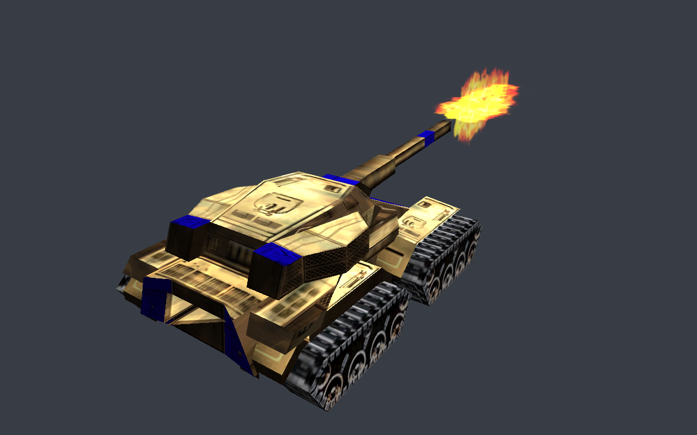

# D-spike — One real model through SDL3's GPU API

- **Milestone:** M4
- **Depends on:** nothing. It deliberately does not wait for D1.
- **Informs:** D2 (what SDL3 GPU can and cannot do against the game's needs), D3 (the shader
  toolchain decision), D4 and D5
- **Status:** done, in review (-a9)
- **Size:** one standalone tool, `Tests/w3d_view`. It is POSIX-only and not in ctest.

## Why

D1 is stuck waiting for a Windows machine, and D2 through D5 are designed on paper against an API
nobody here has drawn with. This spike draws one real game model, with its real textures, through
SDL3's GPU API on this Mac. The first contact between the game's data and the chosen API then
happens before anyone designs an interface around it.

## Goal

`w3d_view` opens an SDL3 window and draws one real model, read only from the Steam data (for
example the Crusader tank from `W3DZH.big`), with its real DDS textures and an orbit camera.

- **W3D:** parsed with WWLib's `chunkio` and the structs in `w3d_file.h`. WW3D2 itself is not built.
- **Textures:** BC1-3 uploaded straight from the DDS, with its mip levels.
- **Shaders:** a vertex and a fragment shader, each written once, reaching both MSL (Metal) and
  SPIR-V (Vulkan) by one approach. SDL_shadercross is measured against hand-written MSL plus
  glslang's SPIR-V, including what each costs as a dependency. The decision goes in D3's task file.
- **Depth:** D24S8 is requested, and one mapping function falls back to D32S8, as D2 will.
- **Linux:** built in a container with gcc and clang. There is no window there, and this file
  says so.

## Done when

- A screenshot of the textured model, rendered on this Mac, is saved in `docs/mac-port/`.
- D3's shader decision is recorded with measurements.
- D2's task file has a section on what the spike learned about SDL3 GPU against the game's needs.
- Nothing in the engine changes.

## Result (-a9, 2026-09-25)

`docs/mac-port/d-spike-crusader-metal.png` shows the Crusader (`Art\W3D\avcrusader.W3D` from
`W3DZH.big`) with its real DDS textures. It was rendered by `w3d_view` through SDL 3.4.16's GPU API on
Metal, on an Apple M3 Pro under macOS 27.0, and read back from the GPU: it is the frame that was
drawn, not a screen grab.

The run:

- 676 vertices, 348 triangles, 13 draws, 2 pipelines.
- Textures:
  - `avcrusader.dds`: BC1 256×256, 9 mips, from `TexturesZH.big`.
  - `Housecolor.dds`: BC1, 9 mips, from `Textures.big`.
  - `EXTnkMzl01.dds`: BC3 128×128, 8 mips.
- Depth: it asked for D24S8 and got D32S8.

The muzzle flash is drawn because the file does not hide it. The game hides it until the weapon
fires. Metal API validation was on (SDL's debug mode) and reported nothing.

Reproduce: `build-mac/w3d_view --data <folder with zerohour/ and generals/> --screenshot out.png`.
Without `--screenshot` it opens a window with an orbit camera (drag to orbit, wheel to zoom).

### What was built

- `Tests/w3d_view/` holds the tool:
  - `w3d_view.cpp`: SDL, the GPU and the camera.
  - `w3d_model.cpp`: W3D through `ChunkLoadClass` over a `RAMFileClass`.
  - `dds_image.cpp`: DDS headers and the BC mip chain.
  - `big_archive.cpp`: the `.big` directory, parsed as `Win32BIGFileSystem::openArchiveFile` parses it.
    That class itself needs gameengine, which does not build off Windows yet (B5).
  - `shaders/`: the one shader written three ways, and the script that turns it into the checked-in
    `model_shaders.h`.
- The model is read the way WW3D2 reads it:
  - the HLOD's top level of detail;
  - pivots built with WWMath's `Matrix3D`/`Quaternion`, as `HTreeClass::read_pivots` builds them;
  - rigid meshes placed by their bone;
  - V flipped as `read_stage_texcoords` flips it;
  - textures renamed `.tga` → `.dds` as `DDSFileClass` renames them.
- Left out, and printed when met: skins, animation, aggregates, later LODs, and every material pass
  and texture stage after the first.
- House colour is a shader tint. The game recolours those textures on the CPU instead
  (`W3DAssetManager::Recolor_Texture`); see D2's notes.
- Engine code changed: none. The CMake change is one POSIX-only target.

### Shaders: three routes, one frame

The same vertex and fragment shader exists as GLSL (`model.vert`/`.frag`), as HLSL
(`model_vs.hlsl`/`model_ps.hlsl`, written in the generators' style: separate `Texture2D` and
`SamplerState`) and as hand-written MSL (`model.hand.metal`). `--shaders glsl|hlsl|hand` picks one.

| Comparison | Pixels that differ |
|:--|:--|
| Metal: GLSL route vs HLSL route vs hand MSL | 0 of 67,124 model pixels, all three identical |
| Vulkan (lavapipe, Linux arm64): GLSL vs HLSL | 0 of 193,304 model pixels |
| Metal vs lavapipe, same route | 82% differ, almost all by 1-3/255, 55 pixels by more than 16 (worst 94). This is two rasterisers and two BC decoders. It is not a transform or winding error: the frames overlay. |

The decision this informs, with the measurements, is in D3's task file.

### Linux

On Linux `w3d_view` builds with GCC 13.3 and Clang 18.1 on ubuntu:24.04, and renders offscreen
through SDL's Vulkan backend on Mesa's lavapipe (`--offscreen --screenshot`, `SDL_VIDEO_DRIVER=offscreen`).

- A container has no display, so no window was opened on Linux. What ran is the offscreen path: the
  same device, pipelines and draws, read back to a PNG.
- lavapipe has D24S8, so the Linux run took the preferred depth format. The Mac run took the
  fallback. Both paths through `mapDepthStencilFormat` were exercised on real devices.
- `Tools/linux-check.sh` (arm64 and amd64 × GCC and Clang) passed all four rows on base `57ae66d7`:
  - full build, and ctest 23/23 in each, with `test_gameengine` disabled and `arch_differential`
    and `d3dx_oracle` skipped, as before;
  - `w3d_view` compiled and linked in every row, with 0 warnings from its own sources.
- After rebasing onto `18d6f3b1`, the two arm64 rows were run again and gave 24/24. The amd64 rows
  were not re-run.
- `w3d_view` also rendered through lavapipe in three rows: arm64 GCC, arm64 Clang and amd64 GCC.
  - GCC and Clang builds give pixel-identical frames.
  - arm64 and amd64 lavapipe differ by at most 5/255 on 77% of model pixels. That is Mesa's CPU
    rasteriser taking different SIMD paths, not the tool.
  - In every row the GLSL and HLSL routes are pixel-identical.

### Not done

- **No real Vulkan GPU.** lavapipe is a CPU implementation. No NVIDIA, AMD or Intel driver has seen
  this SPIR-V.
- **No MoltenVK.** The Vulkan backend was never run on macOS.
- **Not every model.** Only the Crusader was checked. Skinned infantry, animated models, aggregates
  and terrain are not in the spike.
